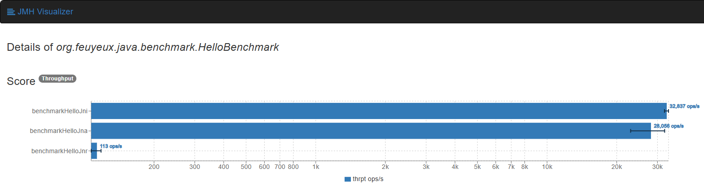

# Java Native

## 1 Concept

**JNI**(Java Native Interface) <https://docs.oracle.com/en/java/javase/19/docs/specs/jni/>

```
                User Code
                    |
Java            JNI call
--------------------|---------------------
C/native        JNI impl
                    |
                Target Library
```

**JNA**(Java Native Library) <https://github.com/java-native-access/jna>

**JNR**(Java Native Runtime) FFI(Foreign Function Interface) <https://github.com/jnr/jnr-ffi>

```
                User Code
                    |
                JNA/JNR stub
                    |
Java            JNI call
--------------------|---------------------
C/native        JNI impl
                    |
                  libffi
                    |
                Target Library
```

## 2 Usage

### 2.1 JNI

#### 1 Java code

`org.feuyeux.java.HelloJni.java`

```java
package org.feuyeux.java;

public class HelloJni {
    // export LD_LIBRARY_PATH=...
    static {
        System.loadLibrary("hello");
    }

    private native String sayHello(String name);

    public static void main(String[] args) {
        String jniResult = new HelloJni().sayHello("JNI");
        System.out.println("Java output:" + jniResult);
    }
}
```

#### 2 C header file

```sh
# generate head
javac -h jni_lib src/main/java/org/feuyeux/java/HelloJni.java
```

#### 3 C impl file

```c
#include <jni.h>
#include <stdio.h>
#include <string.h>
#include "org_feuyeux_java_HelloJni.h"

// Implementation of the native method sayHello()
JNIEXPORT jstring JNICALL Java_org_feuyeux_java_HelloJni_sayHello(JNIEnv *env, jobject thisObj, jstring j_str)
{
    const char *c_str = (*env)->GetStringUTFChars(env, j_str, NULL);
    if (c_str == NULL) {
        return NULL; // Out of memory
    }

    char cs[128] = "Hello ";
    strncat(cs, c_str, sizeof(cs) - strlen(cs) - 1);

    printf("C output: %s\n", cs);

    (*env)->ReleaseStringUTFChars(env, j_str, c_str);

    return (*env)->NewStringUTF(env, cs);
}
```

#### 1.4 build

##### macOS

`libhello.dylib`

```sh
mkdir jni_coon
gcc -I"$JAVA_HOME/include" -I"$JAVA_HOME/include/darwin" -dynamiclib -o jni_coon/libhello.dylib jni_lib/hello_jni.c
```

##### Ubuntu

`libhello.so`

```sh
mkdir jni_coon
gcc -I"$JAVA_HOME/include" -I"$JAVA_HOME/include/linux" -shared -o jni_coon/libhello.so jni_lib/hello_jni.c
```

#### 1.5 build & run java

##### build

```sh
javac -cp ./jni_coon -d jni_lib src/main/java/org/feuyeux/java/HelloJni.java
```

##### run

```sh
cd jni_lib
java -Djava.library.path=../jni_coon org.feuyeux.java.HelloJni
```

##### output

```sh
C output:Hello JNI
Java output:Hello JNI
```

### 2.2 JNA/JNR

#### 1 C code

```sh
mkdir jna_lib
touch jna_lib/hello.c
```

`hello.c`

```c
#include <stdio.h>

char* sayHello(char *name)
{
    static char buffer[50];
    snprintf(buffer, sizeof(buffer), "Hello %s", name);
    printf("C output: %s\n", buffer);
    return buffer;
}
```

#### 2 build `libhello.dylib`

##### macOS

```sh
mkdir jna_coon
gcc -fPIC -shared -o jna_coon/libhello.dylib jna_lib/hello.c
```

##### Ubuntu

```sh
mkdir jna_coon
gcc -fPIC -shared -o jna_coon/libhello.so jna_lib/hello.c
```

#### 3-1 JNA

##### java code

```java
package org.feuyeux.java;

import com.sun.jna.Library;
import com.sun.jna.Native;

public class HelloJna {
    public interface CLibrary extends Library {
        // cp lib/libhello.dylib src/main/resources/
        CLibrary clib = Native.load("hello", CLibrary.class);

        String sayHello(String name);
    }

    public static void main(String[] args) {
        String jnaResult = CLibrary.clib.sayHello("JNA");
        System.out.println("Java output: " + jnaResult);
    }
}
```

##### build

```sh
# jna.version
# ls $HOME/.m2/repository/net/java/dev/jna/jna
export VERSION=5.15.0
export JNA_PATH=$HOME/.m2/repository/net/java/dev/jna/jna/$VERSION/jna-$VERSION.jar
javac -cp $JNA_PATH -d jna_lib src/main/java/org/feuyeux/java/HelloJna.java
```

##### run

```sh
cd jna_lib
java -cp ./:$JNA_PATH:../jna_coon org.feuyeux.java.HelloJna
```

##### output

```sh
C output: Hello JNA
Java output: Hello JNA
```

#### 3-2 JNR

##### java code

```java
package org.feuyeux.java;

import jnr.ffi.LibraryLoader;

public class HelloJnr {
    public interface CLibrary {
        String sayHello(String name);
    }

    public static void main(String[] args) {
        // cp lib/libhello.dylib /usr/local/lib
        CLibrary clib = LibraryLoader.create(CLibrary.class).load("hello");
        String jnrFfi = clib.sayHello("JNR FFI");
        System.out.println("Java output: " + jnrFfi);
    }
}
```

##### build

```sh
mvn dependency:tree |grep jnr -A 10

[INFO] \- com.github.jnr:jnr-ffi:jar:2.2.13:compile
[INFO]    +- com.github.jnr:jffi:jar:1.3.10:compile
[INFO]    +- com.github.jnr:jffi:jar:native:1.3.10:runtime
[INFO]    +- org.ow2.asm:asm:jar:9.2:compile
[INFO]    +- org.ow2.asm:asm-commons:jar:9.2:compile
[INFO]    +- org.ow2.asm:asm-analysis:jar:9.2:compile
[INFO]    +- org.ow2.asm:asm-tree:jar:9.2:compile
[INFO]    +- org.ow2.asm:asm-util:jar:9.2:compile
[INFO]    +- com.github.jnr:jnr-a64asm:jar:1.0.0:compile
[INFO]    \- com.github.jnr:jnr-x86asm:jar:1.0.2:compile
```

```sh
# jnr-ffi.version
export VERSION=2.2.13
export JFFI_VERSION=1.3.10
export ASM_VERSION=9.2
export JNR_PATH=$HOME/.m2/repository/com/github/jnr/jnr-ffi/$VERSION/jnr-ffi-$VERSION.jar
export JFFI_PATH=$HOME/.m2/repository/com/github/jnr/jffi/$JFFI_VERSION/jffi-$JFFI_VERSION.jar
export JFFI_NATIVE_PATH=$HOME/.m2/repository/com/github/jnr/jffi/$JFFI_VERSION/jffi-$JFFI_VERSION-native.jar
export ASM_PATH=$HOME/.m2/repository/org/ow2/asm/asm/$ASM_VERSION/asm-$ASM_VERSION.jar
```

```sh
mkdir jnr_lib
javac -cp ./jna_coon:$JNR_PATH -d jnr_lib src/main/java/org/feuyeux/java/HelloJnr.java
```

##### run

```sh
cd jnr_lib
java -cp ./:../jna_coon:$JNR_PATH:$JFFI_PATH:$JFFI_NATIVE_PATH:$ASM_PATH -Djava.library.path=../jna_coon org.feuyeux.java.HelloJnr
```

##### output

```sh
C output: Hello JNR FFI
Java output: Hello JNR FFI
```

## 3 UT

### macOS

```sh
export jni_coon_path=/Users/hanl5/coding/feuyeux/hello-java-native/jni_coon
export JAVA_LIBRARY_PATH=$JAVA_LIBRARY_PATH:$jni_coon_path
mvn test -Dtest=org.feuyeux.java.HelloTest#testHelloJni
```

### linux

```sh
export jni_coon_path=/mnt/d/coding/hello-java-native/jni_coon
export LD_LIBRARY_PATH=$jni_coon_path:$LD_LIBRARY_PATH
mvn test -Dtest=org.feuyeux.java.HelloTest#testHelloJni
```

```sh
mvn test -Dtest=org.feuyeux.java.HelloTest#testHelloJna
```

```sh
mvn test -Dtest=org.feuyeux.java.HelloTest#testHelloJnr
```

## 4 Benchmark
### macOS

```sh
export jni_coon_path=/Users/hanl5/coding/feuyeux/hello-java-native/jni_coon
export JAVA_LIBRARY_PATH=$JAVA_LIBRARY_PATH:$jni_coon_path
mvn test -Dtest=org.feuyeux.java.benchmark.HelloBenchmark
```

### linux

```sh
export jni_coon_path=/mnt/d/coding/hello-java-native/jni_coon
export LD_LIBRARY_PATH=$jni_coon_path:$LD_LIBRARY_PATH
mvn test -Dtest=org.feuyeux.java.benchmark.HelloBenchmark
```


